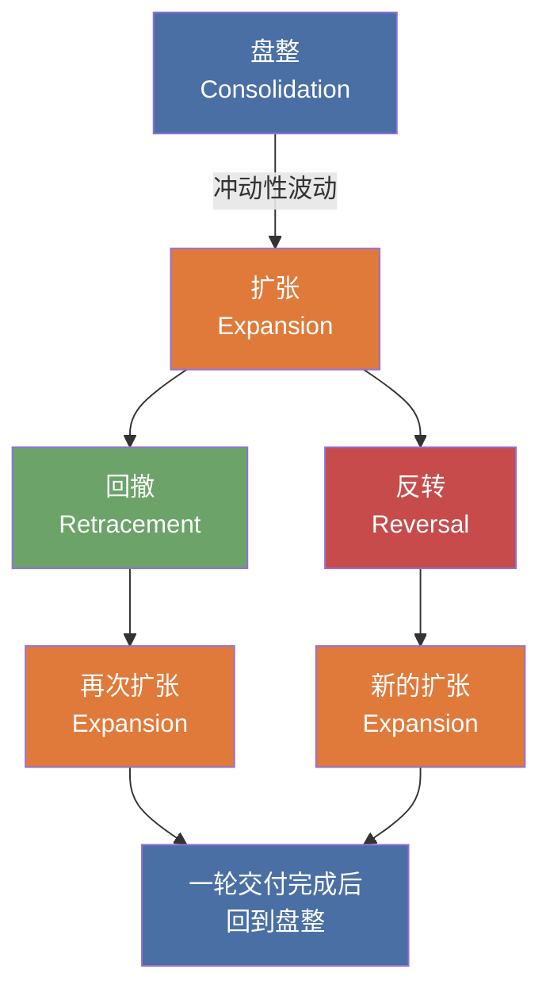

## 笔记

### 交易设置的两个要素

1. **市场背景 / 框架** — 市场当前处于四种状态中的哪一种
2. **机构订单流参考点** — 在该背景下使用对应的ICT工具入场

### [[IPDA 银行间价格交付算法]]

ICT 称之为"银行价格交付算法"（Bank Price Delivery Algorithm），本质上是驱动价格的人工智能引擎。90%的货币报价由电子算法完成，市场被高度操纵。理解该算法的运作方式，就能读懂价格留下的线索，建立预判能力。

### 四种市场状态及其循环

市场在任何时刻只会处于四种状态之一，价格通过这四种状态交付，不可能有其他情况：

1. **[[Expansion 扩张]]** — 价格从均衡水平快速波动，脱离盘整形成趋势
2. **[[Retracement 回撤]]** — 价格回到最近形成的价格区间内部
3. **[[Reversal 反转]]** — 价格向当前运行方向的相反方向移动
4. **[[Consolidation 盘整]]** — 价格在明确的交易范围内波动，无明显方向

四种状态的循环关系（以 M1-02 的更严格表述为准，盘整是万物的开始）：

- 做市商在**盘整**中积累订单，直到区间上下两端积累了足够的资金，随后发动扩张
- 交易者始终等待第一次**扩张**，因为它能提供方向线索
- 按 M1-02 的更严格说法，**扩张**之后不会立刻重新回到**盘整**；它必须先发展出**回撤**或**反转**等后续结构
- 如果扩张过快无法入场，就等**回撤**或下一次**盘整**

### 每种状态对应的 ICT 工具

| 市场状态               | 对应 ICT 工具                                               | 含义                                                              |
| ---------------------- | ----------------------------------------------------------- | ----------------------------------------------------------------- |
| [[Expansion 扩张]]     | [[OrderBlock 订单块]]                                       | 价格快速离开某水平 → 做市商揭示重定价方向 → 等回调至订单块入场    |
| [[Retracement 回撤]]   | [[FairValueGap 公允价值缺口]]、[[LiquidityVoid 流动性真空]] | 价格回到最近区间 → 做市商重新定价未高效交易的水平 → 等填补缺口    |
| [[Reversal 反转]]      | [[LiquidityPool 流动性池]]                                  | 价格反向移动 → 做市商已扫过止损 → 寻找旧高上方/旧低下方的流动性池 |
| [[Consolidation 盘整]] | [[Equilibrium 均衡]]                                        | 价格横盘积累订单 → 等待脱离均衡水平的冲动行情                     |

### 扩张示例（09:10）

![[M1-01_expansion_a.jpg]]

盘整区域（蓝色阴影）有明确的最高价和最低价，均衡价格点在中间。市场突破盘整后形成冲动走势，回看上涨前最后一根阴线即为看涨订单块（Bullish Orderblock）。价格回落触及该订单块时买入，随后向上扩张100多点。

### 回撤示例（11:58）

![[M1-01_retracement_a.jpg]]

价格从某水平迅速偏离（橙色阴影 Liquidity Void），快速波动形成流动性真空——价格未在每个可用水平完成交付。价格回升填补流动性真空（Liquidity Void Filled In）后，恢复原方向跌势。

### 反转示例（13:30）

![[M1-01_reversal_a.jpg]]

旧高上方/旧低下方标记 X 处为止损位置（流动性池）。价格运行至这些水平上方或下方后，扫过止损，随后遭到拒绝并向反方向移动。

### 盘整示例（14:58）

![[M1-01_consolidation_a.jpg]]

这里通过蜡烛实体而非影线定义区间，图中同时标出了 Equilibrium、OTE、62% 与 79% 水平。价格先以扩张方式波动，随后回调至均衡价格点附近，接着再次向外扩张。

## 要点总结

- 交易设置 = 市场背景（四种状态）+ 机构订单流参考点（对应ICT工具）
- 市场只可能处于四种状态之一，不存在第五种情况
- 所有市场波动都源于盘整，盘整是万物的开始
- 以 M1-02 的严格顺序看，盘整之后一定先扩张；扩张之后才可能回撤或反转
- 盘整中做市商积累订单，向资金量大的一端发动攻击
- 不需要掌握所有四种状态，找到一个适合自己的要素就能实现稳定盈利
- 90%的货币报价由电子算法完成，市场被高度操纵，但操纵的迹象可以被识别

## 量化思考：如何程序化识别盘整？

ICT 对盘整的描述特征：

- 有明确可辨的最高价和最低价
- 均衡价格点位于区间中点
- 价格从上方或下方多次触及并在中点附近徘徊
- 没有表现出明显的走高或走低意愿

初步思路：找到一个尽可能长的K线集合，价格多次穿过最高价与最低价之间的中点。

排除法思路：扩张和回撤相对容易识别，扩张前面排除回撤的走势就是盘整。依据：盘整的结束条件就是扩张的开始条件，两者是同一件事的两面。

状态转换的逻辑约束：

- 盘整之后 → 一定是扩张（盘整的唯一出口就是冲动性波动；如果没脱离区间，说明还在盘整中）
- 扩张之后 → 才可能进入回撤或反转
- 回到盘整 → 更适合理解为一整段交付完成后的结果，而不是第一次扩张后的直接下一步

待解决的问题：

- "多次穿过中点"是必要条件但可能不充分——如果区间在不断扩大（扩张中的震荡），不应算作盘整
- 如何定义"区间"？用固定窗口还是自适应？high/low 用影线还是实体？
- 如何量化"无方向性"？价格在区间内来回穿越中点，而非单边靠近上沿或下沿
- 如何判断盘整结束？即检测脱离区间的冲动性波动（扩张的开始）
- 实时检测 vs 历史回标，逻辑是否不同？
- 时间框架的选择是否影响盘整的定义参数？
- **反转在排除法中的位置**：扩张→反转→回撤→扩张的路径中，反转既不是盘整也不是回撤，排除法需要额外处理反转这种状态
- **回撤与盘整的边界**：回撤有方向性和时间预期（短暂回到区间后继续扩张），盘整是无方向且持续时间较长（在区间内反复徘徊）。回撤如果在区间内待太久、多次穿越中点，是否会"演变"为盘整？如何量化这个临界点？

量化上的交易约束：

- **不交易大趋势上的反转**，避免把大级别回撤误判成趋势反转
- 更适合交易的是：在高时间框架偏见下，只做同方向的局部反转与后续扩张
- 对大周期反转，允许等待更多K线确认，以滞后性换确定性；不抢第一根，只交易已确认反转后的大周期扩张
- 量化上可接受的确认链条：扫流动性 → 明确位移 → 结构转移 → 新方向扩张成立

暂存想法：

- 也许可以这样判定盘整：对于一个大于 5 根的 K 线序列，若能找到一条直线，使得一段时间内价格能反复触及它，则可把这条线视为均衡线
- 这相当于先从"可被反复触及的均衡"入手，而不是先从区间 high/low 入手
- 这个想法还不成熟，但值得保留，后续可以继续思考：触及次数、允许偏差、最短持续时间，以及这条线是水平线还是允许轻微斜率
