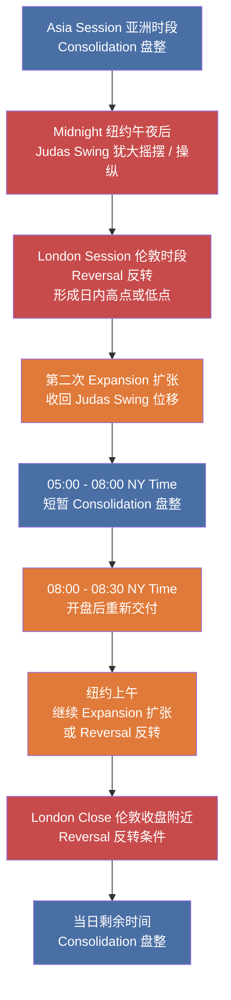

## 笔记

### 前置前提（00:00:00 - 00:12:45）

这一段主要是在重申本课采用的观察视角，而不是提供新的交易结构。

![[M1-02_market_efficiency_paradigm_a.jpg]]

- 默认从 Smart Money 与 [[IPDA 银行间价格交付算法]] 的角度理解市场
- 将银行与流动性提供者视为价格交付的主导者
- 后续关于日内结构、四种状态与价格交付顺序，都建立在这个前提上

对已经接受这一前提的读者而言，这一段更适合作为课程的世界观声明，而不是本课的主要信息增量。

### 日内交易结构（00:12:45 之后）

这一段开始把前一课的四种市场状态，放进具体的日内时间结构里理解。

#### 从日内波幅去理解四种状态

- 每一天通常从 [[Consolidation 盘整]] 开始，对应亚洲时段形成的区间
- 盘整之后首先出现的第一次 [[Expansion 扩张]]，常表现为 [[Judas Swing 犹大摇摆]] 这段操纵性波动
- 伦敦时段附近，价格对这段犹大摇摆发生 [[Reversal 反转]]，并形成日内高点或低点
- 随后的第二次 [[Expansion 扩张]]，用于收回犹大摇摆造成的位移，并开始当天更真实的方向性交付
- 纽约时段在这段扩张之后，常先进入一小段新的盘整，再决定后续是继续扩张还是转入反转
- 到伦敦收盘附近，市场又可能出现一次反转，之后重新回到盘整

#### 固定顺序

课程在这一部分反复强调：

- 市场总是先 [[Consolidation 盘整]]
- 然后进入 [[Expansion 扩张]]
- 不会从盘整直接进入 [[Retracement 回撤]]
- 也不会从盘整直接进入 [[Reversal 反转]]
- 只有在扩张发生之后，才谈得上回撤或反转

也就是说，盘整的唯一出口是扩张；回撤与反转都必须建立在先前已经出现位移的前提上。

#### 日内时间锚点

- `Asia Session 亚洲时段`：先形成盘整区间，价格在平衡状态中积累订单
- `Midnight 纽约午夜后`：常出现第一次 [[Expansion 扩张]]，也就是 [[Judas Swing 犹大摇摆]] 这段操纵性波动
- `London Session 伦敦时段`：价格对犹大摇摆发生反转，并形成日内高点或低点；随后进入第二次扩张
- `05:00 - 08:00 New York Time`：常见一段新的盘整
- `08:00 - 08:30 New York Time`：纽约开盘后重新交付，可能继续扩张，也可能转入反转
- `London Close 伦敦收盘附近`：又是一个容易出现反转的时间窗口，之后市场回到盘整

#### 一个看涨日的简化路径

课程给出的示意可以整理为：

#### 这部分对交易的意义

- 四种状态不是抽象分类，而是可以和具体时间窗口绑定
- 日内研究之所以重要，是因为反馈更快，能反复观察价格交付的固定顺序
- 当高时间框架方向已明确时，日内要做的是等待价格在正确的时间窗口里走完 `[[Consolidation 盘整]] → [[Expansion 扩张]] → [[Retracement 回撤]] / [[Reversal 反转]]` 的结构
- 课程强调，同样的逻辑不只适用于日内，也能映射到周线等更高时间框架

#### 我的理解

- 第一次 [[Expansion 扩张]] 更适合直接理解为 [[Judas Swing 犹大摇摆]] 本身，也就是那段操纵性波动
- 伦敦时段附近的关键动作是对这段犹大摇摆发生 [[Reversal 反转]]，并形成日内高点或低点
- 第二次 [[Expansion 扩张]] 才是对犹大摇摆位移的收回，并开始当天更真实的方向性交付
- 这样整理后，结构可以理解为：`[[Consolidation 盘整]] → 第一次扩张（[[Judas Swing 犹大摇摆]]）→ [[Reversal 反转]] → 第二次扩张 → 纽约小盘整 → 再扩张或反转 → 回到[[Consolidation 盘整]]`
- `08:00 - 08:30` 这段不必急着定义成严格意义上的 [[Retracement 回撤]]，更稳妥的做法是先把它视为纽约开盘后的重新交付，再根据当时结构判断它属于继续扩张还是新的反转过程

## 关键概念

- [[IPDA 银行间价格交付算法]]
- [[Judas Swing 犹大摇摆]]

## 要点总结

- `00:12:45` 之前主要是在建立课程前提
- 对已接受 Smart Money / [[IPDA 银行间价格交付算法]] 视角的读者，这部分可简化阅读
- 日内结构的起点是 `Asia Session 亚洲时段` 的盘整
- 第一次扩张常表现为 [[Judas Swing 犹大摇摆]]，第二次扩张才承担收回位移与真实交付的作用
- 课程把四种市场状态明确绑定到日内时间窗口中观察
