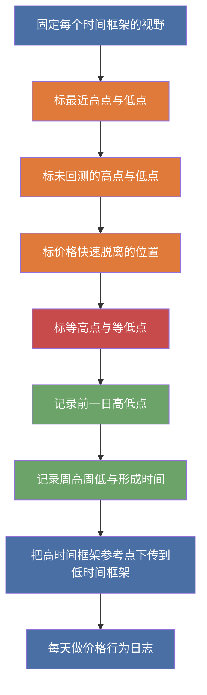

## 章节概要

| 时间戳 | 章节 |
| --- | --- |
| 00:00:00 | 市场参与者的两种对立视角 |
| 00:04:04 | 聪明钱的定价逻辑与流动性优势 |
| 00:08:26 | 价格交付驱动力与初学者心态 |
| 00:12:30 | 建立多周期日志与图表设置要求 |
| 00:16:32 | 识别关键高低点与止损流动性 |
| 00:20:33 | 15分钟图表的日内参考点与总结 |

## 笔记

### 本课重点

M1-03 的重点，不是增加新的模型，而是明确图表中到底要关注什么、记录什么。

课程要求先建立固定的多周期观察框架，再持续做价格行为日志，把这些参考点每天重复记录下来。

### 图表中的核心关注点

#### 1. 最近高点与最近低点

- 先标出市场最近明确形成的高点与低点
- 尤其注意那些形成之后，价格还没有重新回去测试的位置
- 这些位置是后续理解价格交付、寻找目标位的基础

#### 2. 明显位移发生的位置

- 如果价格从某个水平快速拉升或快速打压，这个位置就值得记录
- 也就是价格从某个水平明显脱离的位置
- 这些位置会影响后续对价格应该去哪里、不该去哪里的理解

#### 3. [[EqualHighsAndEqualLows 等高点等低点]]

- 两个相互靠近的高点，可以整理为等高点
- 两个相互靠近的低点，可以整理为等低点
- 课程把它们当作止损容易聚集的地方，也就是 [[LiquidityPool 流动性池]] 常出现的区域
- 价格后续常会把这些显眼流动性作为目标

#### 4. 前一日高点与前一日低点

- 在 15 分钟图上，这两个水平是日内最重要的基础参考点之一
- 课程特别强调要把它们延伸到下一交易日
- 后面观察价格时，要看市场是否先扫前一日高点，还是先扫前一日低点

#### 5. 本周高点与本周低点

- 不只要知道周高周低在哪里
- 还要记录它们是在周几形成的
- 以及形成于哪个时段
- 这些信息会进入后续对周内价格交付的理解

#### 6. 每日高点与每日低点形成的时刻

- 不只是记录价格水平本身
- 还要记录日内最高价、最低价分别是在什么时间形成的
- 本课已经开始把“价格水平”和“形成时段”绑在一起观察

### 多周期图表设置要求

课程先规定每个时间框架应保持的视野长度。

| 时间框架 | 建议视野 |
| --- | --- |
| 日线 | 9 - 12个月 |
| 4小时 | 3个月 |
| 1小时 / 60分钟 | 至少3周 |
| 15分钟 | 至少3 - 4天 |

这里的重点是让每个时间框架都有稳定、重复的观察窗口，而不是随意缩放图表。

### 不同时间框架上分别看什么

#### 日线

- 观察近 `9 - 12个月` 的主要高点与低点
- 标记长期还未回测的关键水平
- 识别价格曾经快速脱离的位置

#### 4小时

- 观察近 `3个月` 的中期结构
- 把日线上的关键参考点细化
- 补充更多清晰可见的高点、低点与明显位移

#### 1小时

- 观察近 `3周` 左右的价格行为
- 用来界定周波动范围
- 观察每一天的高点与低点如何形成

#### 15分钟

- 重点观察近 `3 - 4天`
- 标记前一日高点、前一日低点、最近几天的日内高低点
- 观察价格是否先去触及一侧流动性，再转向另一侧

### 一个更适合执行的观察流程

### 记录时除了价格，还要一起记录什么

- 形成的日期
- 形成的具体时间
- 属于哪个交易时段
- 该水平是否已经被扫过或重新测试过
- 价格离开这个位置时是否表现出明显位移

### 图表组织方式

- 一张图用于承接日线、4小时、1小时传下来的高时间框架参考点
- 一张独立的 15 分钟图，用来整理最近几天的日内参考点
- 还要保留相对干净的执行图表，避免所有信息堆在同一张图上

课程这样安排的目的，是避免图表过于拥挤，也避免交易时僵化地坚持原先的判断。

### 这课和前两课的关系

- M1-01 和 M1-02 更偏向讲价格交付框架
- M1-03 开始把这个框架落到具体的图表观察动作上
- 也就是：你不只是知道市场有 [[Consolidation 盘整]]、[[Expansion 扩张]]、[[Retracement 回撤]]、[[Reversal 反转]]，还要开始在图表上持续记录哪些价格位置会承接这些交付

## 关键概念

- [[IPDA 银行间价格交付算法]]
- [[Consolidation 盘整]]
- [[Expansion 扩张]]
- [[Retracement 回撤]]
- [[Reversal 反转]]
- [[LiquidityPool 流动性池]]
- [[EqualHighsAndEqualLows 等高点等低点]]

## 要点总结

- M1-03 的重点是整理图表中的关注点，而不是新增复杂模型
- 当前最该记录的是最近高低点、未回测高低点、明显位移、等高等低、前一日高低点、周高周低
- 图表分析不能只记价格，还要一起记形成时间与形成时段
- 多周期观察必须固定视野，保持一致的参考框架
- 高时间框架参考点要逐步下传到低时间框架，再配合每日价格行为日志持续观察

## 量化上的意义

从量化角度看，这些被标记出来的位置，本质上都是未来可能提供入场机会的地方。因为它们往往伴随流动性聚集，价格后续重新接近、扫过或拒绝这些水平时，就更容易形成可观察、可定义的入场条件。

- 这些标记位置，不只是事后解释价格的参考点，也是后续可能提供入场机会的位置
- 它们之所以重要，往往正是因为这些位置附近聚集了流动性
- 量化研究时，可以把这些位置当作候选事件点，继续观察价格触及、扫过、拒绝、位移后的后续表现
- 换句话说，先标记流动性可能聚集的位置，再研究价格到达这些位置后的反应，才更容易把图表观察转成可测试的入场规则

如果按代码实现难度来分，`前一日高低点`、`周高低点` 这类水平通常是最好写的。因为它们的定义最直接，边界也最清晰，只要先完成日线与周线切分，就能稳定生成这些参考位置。

相比之下，更难写的是另外两类：

- `等高点 / 等低点`：可以考虑用 `Fractal(3-5)` 先找局部摆点，再结合 `ATR(14)` 的若干倍数作为允许误差范围；如果两个或多个摆点落在这个容差区间内，就可以视为一组近似等高点或等低点
- `结构高点 / 结构低点`：也就是近期真正有意义的摆动高低点，这类位置可以考虑用 `Fractal(5)` 以上去筛选，再通过不同颜色或不同分层标签表示 fractal 等级，从而区分短期摆点与更高级别的结构摆点

这样整理以后，量化上可以先从最容易标准化的 `前一日高低点`、`周高低点` 入手，再逐步推进到 `等高等低` 与 `结构高低点` 的层级识别。
