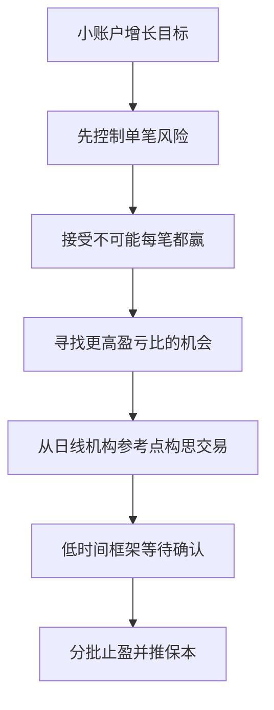

## 章节概要

- `00:00-04:47` 小账户增长的前提：不要把交易当成彩票，不要追求暴利，重点是可持续的百分比回报
- `04:48-08:01` 先学会尊重风险：新手先固定单笔风险，利润是风险管理的副产品
- `08:01-12:29` 胜率与盈亏比的关系：不需要超高胜率，关键是找到合适的风险报酬比
- `12:29-16:23` 设定现实预期：少做、精选、避免大回撤，比炫耀单月暴利更重要
- `16:23-20:03` 小账户复利模型：以每月 `6%` 的净值增长作为可执行目标
- `20:03-34:33` 交易示例：从日线 [[OrderBlock 订单块]] 出发，下钻到 1 小时等待 [[LiquidityPool 流动性池]] 与确认，再做分批止盈

## 笔记

这节课的主线非常明确：小账户不是靠重仓翻倍，而是靠低风险、复利和高质量交易慢慢长大。

### 1. 先放弃暴利幻想

- ICT 一开始就强调：第二个月第一课讨论的是，如何在不承担高风险的前提下增长小账户
- 新手最常见的问题不是方法太少，而是太急，想迅速赚大钱
- 他明确反对追求夸张点数、炫耀式收益，认为真正重要的是账户净值能否稳定增长
- 小账户完全可以从很小的本金起步，字幕里甚至举了 `100 美元` 的例子，重点是让复利发挥作用

### 2. 风险优先，利润靠后

- 课程反复提醒：每一笔交易都有亏损可能，所以新手不能先盯着利润，而要先定义自己愿意承担的风险
- 字幕里明确给出的新手思路是：平均单笔风险不要超过 `2%`
- 一个很重要的表述是：没有人会因为止盈而破产，但很多人会因为承担过高风险而破产
- 这意味着小账户增长的第一原则不是“如何一把赚大”，而是“如何先活下来”

### 3. 胜率不高也可以盈利

- 这节课把数学期望讲得很直接：你不需要 `70%-80%` 的胜率才配赚钱
- 如果胜率只有 `50%`，也可以通过 `1:1` 的盈亏比维持正向结果
- 如果胜率降到 `40%`，就要争取接近 `1:1.5`
- ICT 进一步强调，理想中的最低标准应该是寻找 `1:2` 的交易；如果准确率只有 `25%`，那就要找 `3:1`
- 只要盈亏比足够大，即使错很多次，账户依然可能保持净增长

![[M2-01_盈亏比与胜率.jpg]]

### 4. 现实目标不是月度神话，而是稳定复利

- 字幕里举了 `5000 美元` 小账户一个月做到 `50%` 的例子，但 ICT 明确说这不是每个月都该期待的常态
- 他更看重的是：少做几笔高质量交易，也能把账户慢慢推高
- 与其展示自己经历巨大回撤后又爬回来，不如一开始就避免大回撤
- 课程中提出一个非常务实的目标：以每月 `6%` 的净值增长去思考交易，而不是一周内暴富

### 5. 小账户复利模型

- 这一段的逻辑是：如果每个月稳定增长 `6%`，目标就不是“本周翻倍”，而是一年左右把资金规模有效放大
- 字幕里还给了更可执行的说法：每周只要拿到大约 `20` 点，风险控制在 `1.5%` 左右，即使只是 `1:1` 也有机会完成阶段目标
- 对新手来说，这样的模型更容易坚持，因为心理压力更小，也不会逼着自己天天找交易

### 6. 交易示例：日线订单块 + 1小时确认

- ICT 先回到日线图，寻找价格快速上涨前的最后一根阴线，也就是 [[OrderBlock 订单块]]
- 他特别强调，价格回到这根阴线区域时，不是直接无脑买入，而是把它视为值得关注的机构参考点
- 同时他指出，这里还能看到 [[FairValueGap 公允价值缺口]]，说明价格此前离开得非常急

![[M2-01_日线订单块.jpg]]

- 之后切到 1 小时图，下钻观察更细的结构
- 图中先出现旧低点，旧低点下方有卖方止损；价格下破旧低点，完成止损清扫，并触及日线锁定的 `0.7512` 水平
- 字幕把这里明确描述为进入了海龟汤条件：跌破旧低点后，市场反而可能向上运行
- 这里的核心不是“见低点被扫就立刻做多”，而是继续等待确认，确认银行是否真的支持这个位置

![[M2-01_流动性清扫.jpg]]

- 随后价格上穿 1 小时图中的看涨订单块，ICT 用该蜡烛的开盘价加点差来构建限价入场，示例入场大约在 `0.7542`
- 止损则放在订单块中点下方，字幕中给出的示例止损位约为 `0.7522`，也就是 `20` 点风险
- 上方的等高点和买方止损，提前给出了止盈目标，因此这笔交易在入场前就已经具备了完整的风险回报框架

### 7. 分批止盈比一次性平仓更有弹性

- 这节课后半段最实用的地方，是 ICT 不是只讲“进场”，而是讲怎么把盈利留下来
- 当价格先达到 `1R` 时，可以直接全部平仓结束交易，也可以先减半仓位，把部分利润锁住
- 如果价格继续向上到 `2R`、`3R`，就继续分批止盈，并在更有利的位置把止损推到保本
- 这样做的意义在于：你先给自己“发工资”，同时保留一部分仓位去吃更大的波段
- 小账户要增长，不只是找对方向，更是把盈利结构化地留在账户里

## 关键概念

- [[OrderBlock 订单块]]
- [[FairValueGap 公允价值缺口]]
- [[LiquidityPool 流动性池]]
- [[TurtleSoup 海龟汤]]
- [[BuySideLiquidity 买方流动性]]
- [[SellSideLiquidity 卖方流动性]]

## 要点总结

- 小账户增长靠的是低风险复利，不是重仓搏暴利
- 新手先固定单笔风险，再去谈利润目标
- 胜率不需要特别高，只要盈亏比足够好，交易系统仍然能盈利
- 机构参考点要从高时间框架找，执行则可以下钻到低时间框架等待确认
- 分批止盈、推保本，比一次性赌到终点更适合小账户稳步增长

## 量化部分

- 风险控制基线：新手单笔平均风险尽量不超过 `2%`
- 课程中的务实目标：每月账户净值增长 `6%`
- 胜率与盈亏比示例：`50% -> 1:1`，`40% -> 1:1.5`，理想最低标准是 `1:2`，若胜率仅 `25%` 则至少追求 `3:1`
- 示例交易参数：日线关键位约 `0.7512`，1 小时入场约 `0.7542`，止损约 `0.7522`，风险约 `20` 点
- 执行模型：先看 `1R` 是否减仓，再根据价格是否继续扫向上方买方止损，逐步推进到 `2R`、`3R` 甚至更高
- 量化还有一个额外优势：执行链路可以预先固化，入场、止损、减仓、止盈和停手条件都能提前定义，因此更少依赖临场人性，更容易长期稳定复制
