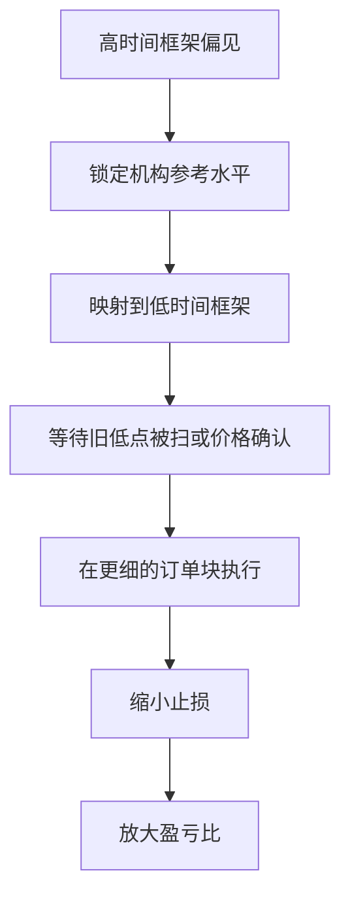

## 章节概要

- `00:00-00:58` 低风险交易的起点：先定义什么样的 setup 值得参与，而不是先找信号
- `00:58-02:33` 高时间框架的重要性：先看月线、周线、日线上的市场偏见与机构订单流
- `02:33-03:48` 核心方法：把高时间框架水平映射到低时间框架，以缩小止损
- `03:48-05:30` 日线到 1 小时案例：利用 `0.7520` 与 `0.7512` 的高时间框架支撑来构思做多
- `05:30-07:38` 1 小时到 15 分钟：在同一逻辑下把入场进一步做细，压缩风险
- `07:39-11:16` 15 分钟到 5 分钟：继续围绕同一个关键水平精炼执行，获得更优盈亏比

## 笔记

这节课本质上是在回答一个问题：低风险交易不是怎么把止损随便缩小，而是怎么在不改变高时间框架逻辑的前提下，把执行精炼到更小的时间周期。

### 1. 先找值得参与的交易，再谈入场

- ICT 开头先把顺序摆正：不是一上来就找入场信号，而是先判断这个 setup 是否值得参与
- 理想情况下，交易设置应该先从高时间框架上选出来，因为高时间框架更能体现市场偏见与机构订单流
- 课程强调，大型机构与银行看的就是月线、周线、日线，所以散户如果脱离这些级别单独做判断，很容易失去方向
- 对无法长期盯盘的人来说，高时间框架 setup 还更友好，因为形成较慢，给了充足规划时间

![[M2-02_高低时间框架映射.jpg]]

### 2. 低风险的关键，不是赌更小止损，而是向下精炼

- 这节课最核心的一句话是：高时间框架条件形成后，可以被细化到低时间框架中执行
- 也就是说，交易逻辑仍然来自高时间框架，但真正的入场和止损，可以在低时间框架上做得更精确
- 这样做的结果不是“看起来更聪明”，而是实际减少止损点数，降低风险敞口
- 所以低风险交易框架的本质，是同一套逻辑在不同时间级别上的递进式展开

### 3. 日线案例：先确认高时间框架前提

- 案例延续上一课的澳元兑美元图表，重点仍然围绕 `0.7520` 和 `0.7512`
- 其中 `0.7512` 被界定为日线级别旧的看涨 [[OrderBlock 订单块]]，ICT 明确说银行曾在这里买入过
- 图表里先有一个旧低点，价格向下跌破旧低点后，进入这个高时间框架关键支撑区域
- ICT 特别强调：不是因为跌破旧低点就一定要反转，而是因为跌破旧低点之后，价格又进入了日线级别值得做多的区域

![[M2-02_日线框架.jpg]]

### 4. 1 小时框架：目标先定好，再考虑风险优化

- 切到 1 小时图后，逻辑依然没变：价格跌入高时间框架支撑，上方存在明确的买方止损目标
- 所以这笔交易从一开始就不是 scalp，而是有更大向上空间的结构性机会
- 在这一层执行时，ICT 用小时图里的看涨订单块给出大约 `0.7542` 的做多入场，止损约 `20` 点
- 这已经是一笔可以做的交易，但课程接着问：如果想更低价买入，并进一步显著压缩风险怎么办？

### 5. 15 分钟框架：同一逻辑，更细执行

- 到了 15 分钟图，仍然能看到几乎相同的结构：旧低点被扫，价格进入 `0.7512` 这一关键水平
- 字幕里直接把它定义为一个做多的乌龟汤条件，也就是跌破旧低点后反而寻找上行机会
- 但这次不需要等价格涨到小时图给出的更高入场区，ICT 开始利用 15 分钟级别更近的看涨订单块提前布局
- 这里给出的示意入场大约在 `0.7520`，止损大约在 `0.7507`，风险从 `20` 点压缩到约 `17` 点

![[M2-02_15分钟乌龟汤.jpg]]

### 6. 5 分钟框架：把执行精炼到极致

- 接着继续切到 5 分钟，观察的还是同一个 `0.7512` 水平，逻辑完全没有换
- 当价格触及该区域后，又出现一根被向上突破的阴线，这就形成了一个更细的看涨订单块依据
- 这时可以从该蜡烛的开盘价到中点区域考虑入场，也可以直接把它简化为在 `0.7515` 附近买入
- 止损仍然可以放在 `0.7507` 下方，这样整笔交易的风险就被压缩到不到 `10` 点，字幕中进一步概括为约 `8` 点风险

![[M2-02_5分钟精炼入场.jpg]]

### 7. 更小的止损，带来更大的 R 倍数

- 一旦风险被压到 `8` 点，价格只要上涨 `24` 点，就已经实现 `3R`
- 这里甚至还没触及 1 小时图上更高一级的买方止损目标，执行时间框架本身就已经提供了不错的收益空间
- 这就是多时间框架精炼的威力：高时间框架提供方向与前提，低时间框架负责改善成本和盈亏比
- 但 ICT 也明确提醒，这不是机械缩止损的游戏，前提是你必须理解价格行为为什么会在这些位置反应

## 关键概念

- [[OrderBlock 订单块]]
- [[LiquidityPool 流动性池]]
- [[TurtleSoup 海龟汤]]
- 市场偏见
- 机构订单流
- 买方止损与卖方止损
- 多时间框架精炼入场

## 要点总结

- 低风险交易的第一步是先确认高时间框架前提，而不是先找入场按钮
- 高时间框架决定方向与参考水平，低时间框架只负责把执行做细
- 同一个 setup 从日线下钻到 1 小时、15 分钟、5 分钟后，止损可以持续压缩
- 缩小止损的目的不是炫技，而是改善盈亏比、降低总风险敞口
- 如果不理解价格行为为何会在关键水平反应，就不能安全使用超短止损

## 量化部分

- 这节课的量化核心不是新增指标，而是把已有交易逻辑拆成一个可重复的执行链路：`高时间框架选点 -> 低时间框架确认 -> 精炼入场 -> 固定止损 -> 按 R 倍数管理收益`
- 同一笔交易在不同执行层级上的风险压缩示例：`1H` 约 `20` 点止损，`15m` 约 `17` 点止损，`5m` 约 `8` 点止损
- 当风险缩小到 `8` 点时，只需 `24` 点利润就能达到 `3R`
- 这里的优势在于，执行链路可以被预先定义，不需要临场靠感觉决策；只要高时间框架前提成立，就能按固定步骤向下精炼
- 量化视角下，更小时间框架不是为了更频繁交易，而是为了在同一逻辑下优化成本、止损和盈亏比
