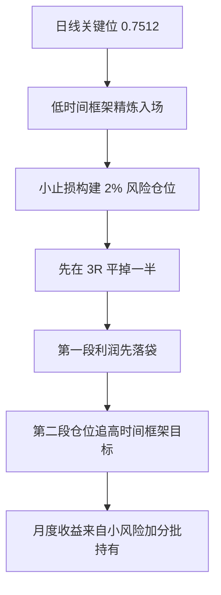

## 章节概要

- `00:00-01:25` 延续前两节课的 AUD/USD 案例，回顾日线 `0.7512`、小时图流动性池与多时间框架入场框架
- `01:25-03:08` 用 15 分钟与 5 分钟执行框架说明：小止损下，`3R` 首次止盈很容易先实现
- `03:08-06:14` 分批止盈与高时间框架目标：先在 `3R` 减仓，再保留第二段仓位追更高流动性池
- `06:14-08:12` 不必抓满全部波幅：拿到中间大段就足够，不要陷入抓顶抓底的执念
- `08:12-12:01` 用 `1000 美元` 账户举例，说明为什么仅凭首段利润就有机会逼近或超过月度 `10%`
- `12:01-17:00` 进一步放大第二段仓位的威力：只拿一半波幅也很强，拿满则更夸张，但不该被贪婪支配
- `17:00-20:42` 交易心理与复利：先给自己发工资，长期稳定月度 `10%` 的复利远比单次炫耀更重要

## 笔记

这节课其实不是在鼓励你幻想“每个月都暴赚 10%”，而是在解释：如果你用极小风险在高时间框架支持的位置做交易，再配合分批止盈，月度 `10%` 并不是靠重仓换来的神话数字。

### 1. 这节课建立在前两课已经验证的框架上

- ICT 一开始直接回顾前两节课：日线已经锁定 `0.7512`，小时图上方也已经识别出买方止损与 [[LiquidityPool 流动性池]]
- 也就是说，这里不是重新找 setup，而是在已确认 setup 的基础上，讨论如何把收益做大
- 字幕里明确说，从 `0.7512` 出发，价格上推 `100` 点到 `0.7612` 是完全合理的高时间框架预期
- 所以本节课的重点从“怎么进场”转向“怎么管理仓位和利润”

![[M2-03_日线起点.jpg]]

### 2. 小止损的价值，不只是好看，而是能更快做到 3R

- 课程继续沿用上一节课的逻辑：15 分钟和 5 分钟可以把执行精炼到更小的风险
- 当止损小于 `10` 点时，只要价格走出一小段延伸，就足以完成 `3:1` 的首次止盈
- 这很重要，因为市场甚至不需要立刻扫完所有更高一级的买方止损，你就已经可以先把第一段利润拿到手
- 这说明真正关键的不是“市场一定得走很远”，而是“你的风险起点够不够低”

![[M2-03_3R首止盈.jpg]]

### 3. 月赚 10% 的核心，在于分批止盈而不是孤注一掷

- ICT 这里给了一个非常具体的资金管理模型：假设整笔交易风险是 `2%`
- 当价格先完成 `3R` 时，先把一半仓位平掉，也就是先处理掉那 `1%` 风险对应的仓位
- 这样第一段仓位就直接兑现了约 `3%` 的账户收益
- 剩下的第二段仓位，则继续朝着更高一级的流动性池运行
- 这一步是整节课最核心的桥梁：先锁定利润，再让剩余仓位去赚“超额部分”

### 4. 第二段仓位才是真正拉开收益差距的地方

- 当价格触及 15 分钟的买方止损流动性池时，字幕里直接给出：这时已经可以做到 `1:9`
- 如果价格继续推进到更高一级的目标，甚至可能扩展到 `15R`
- 当然，ICT 并没有要求你永远拿满，而是强调：只要你已经处于一个很理想的流动性池，就可以考虑再次减仓
- 这也是他一贯的思路：高时间框架决定目标，低时间框架决定执行，流动性池决定你在哪里更积极地兑现利润

![[M2-03_15分钟流动性池.jpg]]

### 5. 不需要抓住全部 100 点，抓住中间一段就已经非常强

- 这节课有一个很重要的心理纠偏：你不需要抓住整段行情的每一个点
- ICT 直接问：如果你只拿到一半波幅，会失望吗？如果会，那本质上就是贪婪
- 交易者最容易犯的错，是既想抓最低点，又想卖在最高点，结果最后什么都没拿到
- 正确的思路是：识别出有 `100` 点潜力的行情后，稳定拿走其中一大段就已经足够优秀
- 这个观点和前两课连得很紧：交易的优势来自低风险与高概率结构，不来自完美预测

### 6. 数学上，第一段利润本身就足以支撑月度目标

- 字幕里用 `1000 美元` 账户举例，如果一笔交易按 `2%` 风险建仓，且在 `3R` 先减掉一半仓位
- 那么第一段仓位本身就已经兑现了 `3%` 的账户增长
- ICT 的论证重点是：如果你每周只做这一类高质量交易，仅仅靠这第一段利润，月度累计就有机会超过 `10%`
- 而这还没有把第二段继续奔向高时间框架目标的利润计算进去
- 也就是说，“月赚 10%”并不是建立在疯狂加杠杆上，而是建立在重复执行低风险高盈亏比结构上

### 7. 先给自己发工资，才能让第二段仓位跑得更稳

- 课程后半段把这个原则讲得很透：你必须先给自己发工资，也就是先减仓、先拿到已实现利润
- 这样做不是软弱，而是为了避免把已到手的大额浮盈又回吐回市场
- ICT 甚至明确反驳那种“必须拿到最终目标才准平仓”的非黑即白思维
- 他自己的经验是：如果不减仓，很多本来赚很多的交易，最后可能回吐到几乎没有意义
- 所以分批止盈不是削弱收益，而是让你更有能力把第二段仓位持有到更高目标

![[M2-03_给自己发工资.jpg]]

### 8. 真正值得盯住的，不是单笔炫耀，而是复利

- 这节课最后把焦点又拉回复利：如果月度 `10%` 能持续复利，一年收益会非常惊人
- 字幕中直接给出一个很醒目的数字：月度 `10%` 复利，全年收益可以超过 `300%`
- 不管这个数字在现实中是否每个月都能复制，ICT 想强调的是：你真正该追求的是长期稳定的资本增长模型
- 也就是：小风险、先落袋、留第二段、对准高时间框架目标、持续复利

## 关键概念

- [[OrderBlock 订单块]]
- [[LiquidityPool 流动性池]]
- 买方止损
- 高时间框架目标
- 多时间框架执行
- 分批止盈
- 风险报酬比 `3R`

## 要点总结

- 月赚 `10%` 的逻辑核心是低风险高盈亏比结构，不是高风险重仓
- 第一段仓位先在 `3R` 落袋，能显著降低心理压力
- 第二段仓位用于追更高一级流动性池，是收益放大的主要来源
- 不需要拿满整段波幅，拿到中间大段已经足够优秀
- 稳定复利比一次性抓到极端利润更重要

## 量化部分

- 这节课把一笔交易拆成了清晰的执行链路：`高时间框架选方向 -> 低时间框架小止损入场 -> 整体风险控制在 2% -> 3R 平掉一半 -> 剩余仓位追高时间框架目标`
- 示例模型：总风险 `2%`，首段在 `3R` 平掉 `1%` 仓位，可直接兑现约 `3%` 的账户增长
- 若第二段仓位只拿到 `100` 点潜在波幅的一半，字幕里的推演依然显示月度收益会非常可观；若拿满整段，收益更高
- 量化视角下，这里的优势不是预测每次都走满，而是把“先锁定首段利润、再保留第二段弹性”固化成规则化流程
- 这也说明收益曲线并不完全依赖完美离场，而更多依赖可重复的仓位分配与风险管理模型
- 对量化来说还有一个非常重要的现实优势：系统可以同时盯多个品种，因此完全可以围绕日线级别的关键位置做筛选和执行，而不必为了寻找机会被迫下钻到小时或分钟级别，在噪音里做剥头皮
