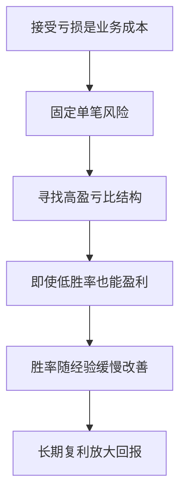

## 章节概要

- `00:00-01:49` 亏损恐惧如何摧毁执行：怕亏会让人长期做出基于恐惧的决策，最终失去盈利能力
- `01:49-04:11` 用 [[OrderBlock 订单块]]、[[FairValueGap 公允价值缺口]] 与固定止损说明如何构建高盈亏比交易
- `04:11-06:47` 在 `30%` 胜率、`1%` 风险、`3:1` 盈亏比下，十笔交易依然可以获得正收益
- `06:47-10:29` 把盈亏比提高到 `5:1` 后，即便胜率仍只有 `30%`，回报也会明显放大
- `10:29-16:11` 当胜率从 `30%` 提升到 `40%-50%` 时，同样的风险参数会带来指数级改善
- `16:11-21:52` 现实目标与资金管理原则：低风险、合理回报、接受亏损是专业交易者的基本框架

## 笔记

这节课的重点不是安慰你“亏损没关系”，而是用一连串非常具体的数字证明：亏损本身不会摧毁盈利能力，真正摧毁交易的是对亏损的恐惧，以及因此产生的错误决策。

### 1. 恐惧亏损，真正伤害的是执行链路

- ICT 开场就讲得很直接：亏损不会自动削弱你的获利能力，但对亏损的恐惧会
- 一旦交易者无法接受亏损，注意力就会持续放在“不想亏”上，而不是放在是否按照系统执行上
- 这种状态最终会演变成两种结果：要么交易瘫痪，不敢下手；要么执行效率极差，总是在最差的时候改计划
- 所以这节课的出发点不是情绪安慰，而是把亏损重新定义为交易业务中的正常成本

### 2. 先构建对自己有利的盈亏比，而不是先追求高胜率

- 为了说明这个问题，ICT 用一个标准的看涨 [[OrderBlock 订单块]] 模型来讲解
- 价格回到此前机构买入区域，订单块区间和 [[FairValueGap 公允价值缺口]] 共同构成支撑逻辑
- 示例里用 `20` 点止损来定义风险，再向上去寻找旧高点上方的目标
- 这样一来，交易从一开始就不是“猜涨跌”，而是“构建一个至少 `3:1`，最好 `5:1` 以上”的收益结构

![[M2-04_订单块与FVG.jpg]]

### 3. 30% 胜率 + 3R，依然是赚钱的

- 课程先给出一个保守到几乎让人不舒服的例子：`5000` 美元账户，每笔交易只风险 `1%`
- 在 `10` 笔交易里，只有 `3` 笔盈利，`7` 笔亏损，也就是胜率只有 `30%`
- 但因为盈利交易按 `3:1` 设计，平均每笔赚 `150` 美元，亏损每笔只亏 `50` 美元
- 所以 `3` 笔胜单总共赚 `450` 美元，`7` 笔亏单总共亏 `350` 美元，最后依然是净盈利
- 这段演示的重点就是：低胜率不等于不能赚钱，关键是收益结构必须站在你这边

![[M2-04_盈亏比核心论点.jpg]]

### 4. 把盈亏比抬到 5R，结果立刻不同

- 接着 ICT 把同样的样本条件升级到 `5:1`
- 胜率还是 `30%`，交易次数还是 `10` 笔，但盈利单的平均利润从 `150` 美元提升到 `250` 美元
- 在这个模型下，`3` 笔胜单总共赚 `750` 美元，`7` 笔亏单仍总共亏 `350` 美元
- 最终净利润变成 `400` 美元，也就是大约 `8%` 的账户回报
- 这就是他反复强调的核心：不要执着于把胜率搞到 `90%`，真正应该努力的是持续找到对自己更有利的盈亏比结构

![[M2-04_30胜率5R.jpg]]

### 5. 风险拉到 2%，胜率仍只有 30%，回报依旧可观

- 然后课程继续推进：如果把单笔风险从 `1%` 提高到 `2%`，但仍保持 `30%` 胜率和 `5:1` 模型会怎样？
- 字幕里的结果是，平均盈利变成 `500` 美元，平均亏损变成 `100` 美元
- `3` 笔胜单共赚 `1500` 美元，`7` 笔亏单共亏 `700` 美元，净利润约为 `15%`
- ICT 借这个例子强调：即便准确率非常低，只要风险明确、盈亏比优秀，回报仍然可能很强
- 但更重要的是，他并没有鼓励无限放大风险，而是在说明收益来自结构，不来自情绪化加码

### 6. 随着经验提高，胜率只要从 30% 提到 40%-50%，结果就会大幅改善

- 这节课后半段最有力的地方，在于它展示了“轻微改善”会带来怎样的结果
- 当条件仍是 `5:1`、单笔风险 `2%`，但胜率从 `30%` 升到 `40%` 时，月回报就被推演到约 `28%`
- 如果胜率提高到 `50%`，净回报甚至会达到约 `40%`
- 更保守一点，如果仍然维持 `50%` 胜率和 `5:1`，但把单笔风险降回 `1%`，结果仍然可以接近 `20%`
- ICT 的论证重点非常明确：交易能力提升并不需要从 `30%` 直接跳到 `90%`，只要小幅改善，盈亏结构就会迅速放大收益

![[M2-04_50胜率1风险5R.jpg]]

### 7. 专业目标应该现实、可复制，而不是被夸张数字绑架

- 课程最后又把视角拉回现实：即使每月只有 `1%-2%`，对很多基金和资金管理者来说都已经是非常优秀的成绩
- 如果风险只有 `0.5%-1%`，而月回报还能达到 `10%`，就更不应该觉得“不够”
- ICT 强调，很多外部资金真正想要的，不是某个月暴赚，而是长期稳定、可复利的资金曲线
- 所以“不害怕亏损”的真正含义不是无视亏损，而是知道亏损是可预期、可承受、可被优质盈亏比覆盖的

### 8. 先定账户风险，再倒推仓位

- 这节课最后给了一个很实用的执行公式：先确定账户风险百分比，再根据止损点数计算每点价值
- 比如 `5000` 美元账户，如果单笔只风险 `1%`，那最大亏损就是 `50` 美元
- 如果止损是 `20` 点，就用 `50` 美元去除以 `20` 点，得到每点可承受的价值
- 这一步很关键，因为它把“不要怕亏”转化成了具体可执行的仓位模型，而不是一句空话

## 关键概念

- [[OrderBlock 订单块]]
- [[FairValueGap 公允价值缺口]]
- 价格行为
- 风险报酬比 `3:1`
- 风险报酬比 `5:1`
- 单笔账户风险 `1%`
- 单笔账户风险 `2%`

## 要点总结

- 亏损不可避免，但亏损本身不会自动摧毁盈利能力
- 真正危险的是对亏损的恐惧，它会破坏执行
- 低胜率系统只要盈亏比足够好，依然可以长期盈利
- 交易应先固定账户风险，再根据止损点数倒推仓位
- 专业交易追求的是稳定、可复利、可持续的收益结构
- 新手初期不应盲目追求过大的盈亏比，因为目标越远、持仓越久，心理压力往往越大；在尚未熟练掌握系统前，先稳定执行 `2R-3R` 往往比强追 `5R+` 更现实

## 量化部分

- 这节课非常适合量化化表达，因为它几乎整节都在讲一个可编程的收益模型：`固定账户风险 -> 固定止损 -> 固定盈亏比 -> 观察不同胜率下的净回报`
- 字幕中的几个关键样本：`30%` 胜率 + `1%` 风险 + `3:1`，十笔交易约得 `2%`；`30%` 胜率 + `1%` 风险 + `5:1`，十笔交易约得 `8%`
- 若改成 `30%` 胜率 + `2%` 风险 + `5:1`，结果可推演到约 `15%`；若 `50%` 胜率 + `1%` 风险 + `5:1`，则可接近 `20%`
- 量化系统相对主观交易还有一个天然优势：程序没有“害怕亏损”的心理负担，不会因为连续止损就临场改规则、缩手、犹豫或报复性交易
- 对量化来说，重点不是消灭亏损，而是确认策略是否拥有正期望值，然后机械地执行仓位、止损和盈亏比参数
- 结合你前面提到的高时间框架思路，量化更适合在多个品种上同时筛选日线级别关键位置，再统一执行风险模型，而不是因为恐惧或无聊被拖进低时间框架噪音里做剥头皮
