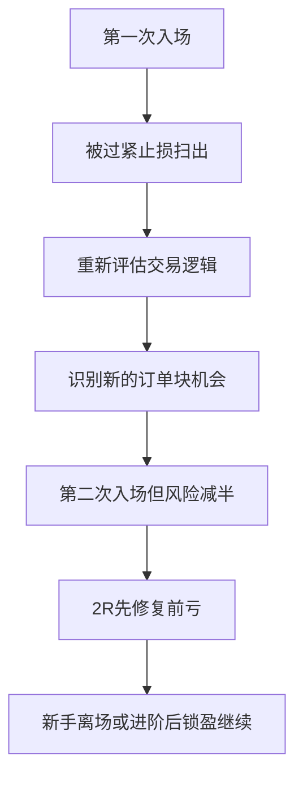

## 章节概要

- `00:00-01:32` 初始做多设想：识别看涨 [[OrderBlock 订单块]]、订单块中点和首次多头入场
- `01:32-03:38` 第一次被扫损后，重新评估交易逻辑：被止损不一定意味着方向错了，可能只是止损太紧
- `03:38-06:52` 识别新的订单块并进行二次入场，同时把风险减半、给市场更大波动空间
- `06:52-09:44` 用半风险交易在 `1R-2R` 内修复前一笔亏损，周尾时回本即可考虑离场
- `09:44-12:12` 达到 `2R-3R` 后的处理原则：先修复回撤，再移动止损锁定利润
- `12:12-15:55` 新手与进阶交易者的差异：新手修复亏损后宜直接离场，进阶后才考虑继续持有
- `15:55-19:04` 最深层原则：亏损后要降风险而不是加风险，保护本金与心理资本优先

## 笔记

这节课延续上一讲，但重点从“不要害怕亏损”更进一步推进到“亏损后到底该怎么处理”。ICT 的答案不是加码摊平，也不是情绪化报复性交易，而是在确认交易逻辑仍成立时，用更小风险去重新参与，并优先修复回撤。

### 1. 第一次亏损，不一定代表思路失效

- 课程开头沿用同一段价格行为样本，先标记看涨 [[OrderBlock 订单块]]、回撤位置、订单块中点和假设多头入场
- 新手很常见的做法，是把止损紧贴在订单块中点下方，希望拿到更好的盈亏比
- ICT 这里要强调的是：如果这种止损被扫掉，不要立刻把整笔交易定义为“完全错了”
- 很多时候问题不是方向错，而只是止损放得过紧，市场需要更大的波动空间

![[M2-05_首次入场与中点止损.jpg]]

### 2. 被扫损后，先重审逻辑，再决定要不要重进

- 字幕里有一句很关键：如果交易没有完全瓦解，只是初次做多时价格扫过了订单块中点把你洗出场，这并不意味着 setup 已经失效
- 换句话说，第一次止损后不该立刻进入“我错了 / 市场坏了 / 我要报复回来”的情绪模式
- 真正应该做的是重新审视：高时间框架和当前结构是否仍支持原先方向
- 如果答案还是支持，那么你面对的是一次新的交易机会，而不是一次必须赌回来的复仇单

### 3. 第二次入场的关键变化，不是更激进，而是更保守

- ICT 接着在图上找到了新的看涨订单块：价格再次上冲，形成新的阴线参考区，后续回踩该区就构成新的买点
- 这一次不再追求极窄止损，而是把止损放到真正构建交易的订单块下方，让市场有更合理的呼吸空间
- 更重要的是，第二次入场不应该和第一次用同样的风险规模
- 课程规则写得很清楚：如果第一笔亏了 `2%`，第二笔就降到 `1%`；如果第一笔亏了 `1%`，第二笔就降到 `0.5%`
- 也就是说，二次入场的核心不是“更有信心所以加倍”，而是“既然刚错过一次，就用更低杠杆再确认一次”

![[M2-05_二次入场新订单块.jpg]]

### 4. 用半风险，也足以修复前面的亏损

- 这节课最有意思的地方，在于它用 R 倍数把“亏损修复”算得很清楚
- 如果第二笔交易只用第一次一半的风险，例如 `1%`，那么价格走到 `1R` 时，就已经赚回了第一次亏损的一半
- 当第二笔走到 `2R` 时，就足以抵消前面 `2%` 的全额亏损
- 关键点在于：市场甚至不需要跑到你原本设想的最终目标，你就已经完成了回撤修复
- 这也是 ICT 想让人建立的思维：不是每次都要靠一笔大赚翻盘，很多时候只要用更稳的方式把账户拉回原位就足够了

![[M2-05_半风险修复亏损.jpg]]

### 5. 周尾如果已经回本，离场往往是更专业的选择

- ICT 在这里非常偏实务地提醒：如果这已经是周四、周五，而市场刚好给了你修复前亏的机会
- 那最应该做的事情之一，就是直接平仓，结束这一周，不要带着净亏损进入周末
- 他强调的不是“怕错过后面行情”，而是“既然市场已经给你补错的机会，就先把这个机会兑现”
- 对还在成长阶段的交易者来说，回到盈亏平衡、空仓休息、重新调整状态，本身就是一次很成功的处理

### 6. 一旦修复回撤，就不能再允许账户掉回去

- 当第二笔交易已经走到 `2R` 或更高时，课程给出的原则非常明确：亏损既然已经被弥补，就必须锁定它
- 如果你不直接离场，那就必须向上移动止损，确保市场不会再把账户打回原来的回撤区间
- 在 ICT 看来，`2R` 已足以完成亏损修复，而 `3R` 往往就是非常理想的止盈位置
- 这里的重点不是赚更多，而是守住已经修复好的净值

![[M2-05_2R3R处理原则.jpg]]

### 7. 新手和进阶交易者，在这里的处理应当不同

- 这节课明确区分了两个阶段
- 对新手来说，一旦修复了亏损，最好的训练是直接平仓离场，把注意力放在“我已经纠正错误并保护了账户”上
- 对进阶交易者来说，在修复回撤之后，可以开始学习把止损上移、锁住利润，再观察市场是否还有延伸空间
- 这个区分很重要，因为很多人问题不在方向判断，而在过早追求“把一笔交易榨干”

### 8. 亏损后降低风险，是保护本金而不是示弱

- 课程最后讲得非常直接：亏损后不降杠杆，是危险的思维方式
- 因为没有任何人能保证一次亏损之后，不会接着进入连续亏损期
- 如果刚亏了 `2%`，下一笔还继续用 `2%` 甚至更高的风险，你是在用资金和情绪同时冒险
- ICT 把这件事归结为两个词：保护本金、保护心理资本
- 所以这节课最深的原则其实不是“如何快速赚回亏损”，而是“如何在亏损后仍然保持系统的生存能力”

## 关键概念

- [[OrderBlock 订单块]]
- 订单块中点
- 回撤
- 二次入场
- 风险减半
- `1R`、`2R`、`3R`
- 保护本金

## 要点总结

- 被扫损不一定代表交易逻辑失效，很多时候只是第一次止损过紧
- 亏损后应重新评估 setup，而不是情绪化地报复性加码
- 二次入场的核心不是放大风险，而是降低杠杆、给市场更合理的空间
- 新手在修复亏损后更适合直接离场，先训练保护净值的习惯
- 保护本金和心理资本，比执着于单笔交易赚回全部亏损更重要

## 量化部分

- 这节课的核心思想对主观交易员非常重要：亏损后把风险减半，可以降低再次开仓时的心理压力，也更容易执行第二次机会
- 但对量化系统来说，这里面要分开看：如果系统本身已经验证过正期望值，而且执行不依赖人类情绪，那么“减半风险”不一定是为了心理承受力，而更像是一种回撤控制规则
- 也就是说，人类交易员减半风险，很多时候是在给自己争取重新上车的心理缓冲；硅基交易员则不需要靠减半风险来缓解再次开仓的恐惧
- 从量化角度看，更合理的做法是先判断：连续亏损后是否需要依据策略统计特性做动态风险调整；如果策略 edge 没变，就不应该仅仅因为“怕下一笔再亏”而主观缩手
- 因此，这节课更适合作为“人类交易员如何管理亏损后的情绪与仓位”的参考，而不是直接照搬成量化系统的固定规则
- 真正适合量化吸收的部分是：把“重新评估 setup 是否仍成立”“是否需要更宽止损”“是否需要新的入场结构”这些条件规则化，而不是把恐惧本身纳入决策
