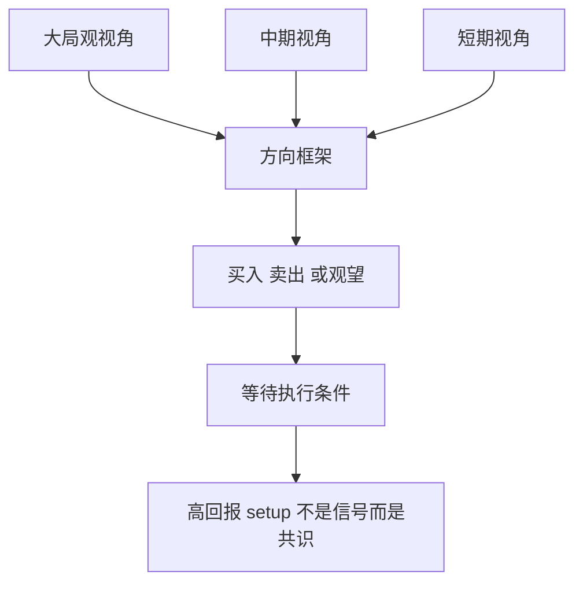

## 章节概要

- `00:00-05:00` 课程定位：高回报 setup 不是信号清单，而是更贴近 ICT 实战流程的“决策框架”
- `05:00-10:52` 交易必须流程化、二元化：先判断交易环境，再决定买、卖还是观望
- `10:52-20:12` 为什么先学过程而不是先学信号：新手真正缺的不是 entry，而是知道该找什么、去哪里找
- `20:12-28:00` 大局观视角：宏观、利率、跨市场、季节性四个研究领域中至少两项达成一致
- `28:00-38:08` 中期视角：自上而下分析、COT、市场情绪三者中至少两项达成一致
- `38:08-49:05` 短期视角：相关性分析、时间与价格理论、[[IPDA 银行间价格交付算法]] 共同构成执行背景
- `49:05-01:06:07` 高回报 setup 的本质：三重视角共识 + 过程思维，而不是单一技术形态

## 笔记

这节课非常像一堂“交易操作系统架构课”。ICT 反复强调：高回报交易设置的秘密，不是某个订单块、某个 SMT 或某个犹大摇摆本身，而是你如何把大局观、中期、短期三个视角组织成一个流程化决策系统。

### 1. 这节课讲的不是信号，而是流程

- 开头 ICT 就明确提醒：这堂课不会教你具体入场、止损、交易管理，也不是在展示某种神奇形态
- 它更像是《交易计划开发系列》的压缩版，但更贴近他自己作为外汇交易者的真实决策流程
- 这节课最重要的目标是先让你知道：交易前到底应该先看什么、按什么顺序看、如何得出买卖或观望的判断
- 所以这里的“高回报”不是指某个图形突然冒出来，而是指一整套流程最终形成的方向性优势

### 2. 真正的秘密是：先决定自己是买方、卖方还是旁观者

- ICT 把交易真正的核心说得非常直白：你必须知道自己现在站在哪一边
- 不是“我好像有点想买”，也不是“价格刚涨了 60 分钟所以我追进去”，而是要有明确的流程把你推向买、卖或不动
- 他甚至强调，这个决策过程必须是二元化、非黑即白的：执行或不执行，没有模糊地带
- 一旦你没有这种清晰流程，情绪、社交媒体、论坛、他人观点就会填补这个空白，把你拖回反应式交易

### 3. 新手最缺的不是信号，而是“知道该找什么”

- 课程中有一个反复出现的提醒：大家总想看 entry、exit、具体信号，但那不是现在最缺的东西
- ICT 认为，大多数初学者并不是真的缺少信号，因为市场上信号到处都是
- 真正缺的是一套流程：知道自己在寻找什么、这些信息从哪里来、哪些因素必须先成立
- 如果这个层面不先补上，那么就算你知道 [[OrderBlock 订单块]]、Breaker、Mitigation Block、[[Judas Swing 犹大摇摆]]，它们也会变成看起来很炫但无法稳定复用的“玩具”

### 4. 大局观视角：先定宏观方向

- 从 `20:12` 开始，课程进入三层结构的第一层：大局观视角
- ICT 说大局观有四个研究领域：宏观市场分析、利率分析、跨市场分析、季节性影响
- 它们不需要全部一致，但至少要有两项达成一致，才能形成有效的大局观偏向
- 宏观市场分析主要是看通胀/通缩环境；利率分析关注利率趋势、突发加减息和央行干预；跨市场分析主要看 CRB 商品指数与美元指数的关系；季节性则帮助判断特定资产在某个阶段的天然偏向

![[M2-06_大局观四领域.jpg]]

- 这部分本质上是在回答：从更高层看，你更应该偏向做美元强、美元弱，还是做某类资产的季节性方向
- 对人类交易员来说，这一步很重要，因为它能防止你被眼前短线波动带偏
- 对量化来说，这一层更像 regime filter，用来限制你只在特定宏观背景下启用某类 setup

### 5. 中期视角：把宏观方向落到可执行的市场背景上

- 第二层是中期视角，由三部分组成：自上而下分析、COT 持仓报告、市场情绪
- 同样，至少要有两项达成一致，才足以支持一个中期方向
- 自上而下分析从月线、周线、日线出发，寻找关键水平、中长期高低点以及高时间框架 [[OrderBlock 订单块]]
- COT 则重点看商业交易者和聪明钱的极端持仓变化；市场情绪则用来观察极端看涨或极端看跌的共识状态

![[M2-06_中期视角三要素.jpg]]

- ICT 这里特别强调，真正驱动价格的是月线、周线、日线，而不是 1 分钟、5 分钟图
- 低时间框架只是这些高时间框架分析结果的表现形式，不是市场的驱动源
- 这点和你前面的量化判断很一致：如果可以同时观察多个品种，其实更没必要被低周期噪音牵着走

### 6. 短期视角：相关性、时间价格理论与 IPDA

- 第三层是短期视角，由相关性分析、时间与价格理论、[[IPDA 银行间价格交付算法]] 组成
- 相关性部分主要看美元指数 SMT，以及相关货币对之间的 SMT 或相关性破裂
- 时间价格理论则包括季度效应、月度效应、周线范围、日线范围、PO3 以及一天中的具体时间段
- IPDA 则帮助理解机构订单流、流动性在哪里、旧高旧低为什么会被扫、市场为什么要去找这些止损

### 7. 高回报 setup 的本质，是三重视角共识

- 到这里，课程把所有东西汇总成一句话：高回报 setup 来自大局观、中期、短期三个视角的一致性
- 当这三层都指向你应该做买方，或者都指向你应该做卖方时，你才真正拥有了一个高质量背景
- 这并不保证每一笔都会赢，但它提供了一个足够强的“交易背景”，让你不是在随机找 entry，而是在顺着多层共识执行

![[M2-06_三重视角总览.jpg]]

- ICT 还特别说，大局观和中期视角通常在周末或周初完成，短期视角才是每天都会变化的部分
- 所以大量工作其实发生在幕后：你真正花时间的地方，不是点击下单，而是判断该做买方还是卖方

### 8. 这节课对人类交易员特别重要，因为它本质上在训练“抑制冲动”

- 这节课有大量篇幅都在对抗一种典型新手状态：急着要信号、急着要做点什么、急着进市场证明自己
- ICT 反复提醒：职业交易者不会急着投入资金，他们更愿意坐着等“合理场景”出现
- 这说明本课并不只是技术框架，更是一种行为框架：如何从冲动、反应式、社交媒体干扰中抽离出来
- 你前面说“06 也更多是给人类交易员的”，这个判断很对，因为其中大量内容都在处理人的执行习惯、认知顺序和信息消化方式

### 9. 对量化系统，这节课更像“策略架构图”而不是交易信号课

- 如果从量化角度看，这堂课几乎不是在教某个 entry setup，而是在教如何建立一个多层过滤系统
- 大局观可以被理解成 regime filter，中期视角可以被理解成 directional bias filter，短期视角则更像 execution trigger context
- 其中很多内容都能被部分规则化，比如利率方向、商品与美元的相对关系、COT 极端值、季节性、相关性破裂、时间窗口、流动性目标
- 但它最重要的启发仍然是结构性的：不要把系统建立在单一信号上，而要建立在“多层共识之后才允许出手”的框架上
- 这也是为什么本课虽然偏向人类交易员，但对硅基交易员同样有价值：它提供的是策略架构，不是情绪安抚

![[M2-06_高回报共识条件.jpg]]

## 关键概念

- [[OrderBlock 订单块]]
- Breaker 破坏块
- Mitigation Block 缓解块
- [[IPDA 银行间价格交付算法]]
- SMT 背离
- 自上而下分析
- COT 持仓报告
- 市场情绪
- 时间与价格理论

## 要点总结

- 高回报 setup 的核心不是某个信号，而是多层决策框架达成共识
- 交易必须先二元化：买、卖或观望，而不是模糊主观判断
- 大局观、中期、短期三个视角分别负责宏观偏向、中期背景和执行定位
- 真正成熟的交易者花大量时间做幕后准备，执行本身反而只占很小一部分
- 这节课更多是在训练人类交易员抑制冲动、建立流程，而不是直接给一个可机械复制的 entry 模板

## 量化部分

- 这节课对量化最有价值的地方，不是某个单独指标，而是“多层过滤架构”：`大局观 regime -> 中期 bias -> 短期 execution context`
- 其中很多因子都可以尝试规则化：利率方向、CRB 与美元关系、季节性、COT 极端值、情绪极值、相关性破裂、时间窗口、流动性目标
- 但本课本身更多是在训练人类交易员的流程思维，因为人类最大的问题通常不是没有信号，而是过早行动、过度反应、被外部噪音带偏
- 对硅基交易员而言，不需要用这节课来对抗“冲动下单”或“急于找信号”的心理问题；程序本身不会因为坐立不安而乱做交易
- 因此量化真正该吸收的是：把单一 setup 提升成分层决策树，只有在多层条件同时成立时才允许策略激活
- 这也解释了为什么量化可以天然避开很多人类交易员的典型错误：它不会因为 FOMO、社交媒体、论坛情绪或想快点交易而跳过流程
- 更重要的是，这节课里提到的短期视角内容本身就非常适合量化研究：时间与价格因素、[[IPDA 银行间价格交付算法]]、机构订单流、流动性位置以及市场效率范式，这些都不是“人类心理安慰”，而是真正决定策略 edge 的结构性信息
- 换句话说，量化交易者未必需要照搬人类交易员的主观判断方式，但必须认真研究这些底层变量如何影响收益分布、止损位置、目标位选择和不同市场状态下的胜率变化
- 对量化系统而言，流程思维并不是需要额外训练的能力，因为程序天然按流程执行；真正重要的是流程中纳入了哪些有效变量，以及这些规则是否真实反映市场结构
