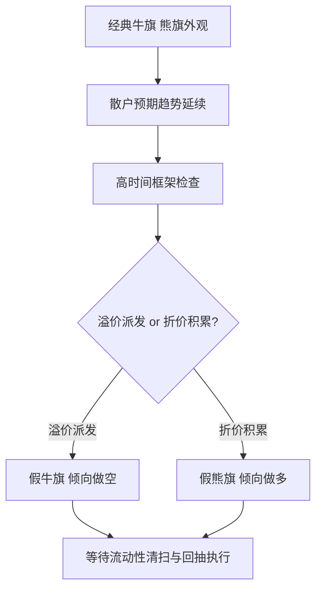

## 章节概要

- `00:00-03:55` 课程主题：经典牛旗、熊旗在高时间框架关键区里经常变成做市商陷阱
- `03:55-07:57` 回顾经典旗形定义：旗杆、旗面、等幅目标，以及为什么它们在趋势成熟时会失效
- `07:57-12:50` 假牛旗案例：看似延续上涨，实则位于日线看跌 [[OrderBlock 订单块]] 与溢价派发区
- `12:50-19:53` 多时间框架拆解假牛旗：从日线、4小时、1小时、15分钟、5分钟下钻，寻找 [[FairValueGap 公允价值缺口]] 与订单流证据
- `19:53-26:27` 假熊旗案例：看似继续下跌，实则位于关键支撑和扫低流动性后的反转区
- `26:27-31:05` 核心结论：不要交易旗形本身，而要交易“别人如何被旗形误导”以及流动性将被如何清扫

## 笔记

这节课的核心不是教你识别旗形，而是教你放弃对旗形的迷信。ICT 的重点非常明确：做市商和机构会利用散户熟悉的经典延续形态制造错误预期，真正有优势的做法不是机械交易旗形，而是先确定高时间框架位置，再利用这些“看起来很标准”的形态去反推流动性陷阱。

### 1. 旗形之所以危险，是因为它太“像样”了

- 课程开头就点明：伪信号旗形是经典图表分析师和纯形态交易者最容易深受其害的模式之一
- ICT 自己也承认，早期学商品交易时就常被这类延续形态欺骗
- 问题不在于牛旗、熊旗的定义有多模糊，而恰恰在于它们往往长得非常标准，所以特别容易让人放松警惕
- 因此这节课真正要学的，不是如何“更快认出旗形”，而是如何看穿旗形出现的上下文

### 2. 经典牛旗、熊旗本身并不是完全无效

- ICT 先花了一段时间回顾经典定义：牛旗是快速上涨后的短期盘整，随后继续上冲；熊旗则是快速下跌后的短期盘整，再继续下跌
- 这种模式背后是一个等幅波动或 `ABCD` 延续的想法
- 他甚至承认自己早年在商品市场里，确实用过这种简单模式赚钱，尤其在随机指标背离配合的时候
- 但问题在于：如果你不理解高时间框架、溢价折价、趋势成熟度和机构订单流，形态本身并不可靠

![[M2-07_经典牛旗结构.jpg]]

### 3. 假牛旗的本质：在高位制造延续幻想

- 第一个案例中，价格快速上涨后进入一个很小的整理区，外观上完全符合经典牛旗
- 如果只看当前时间框架，散户很自然会去量旗杆、算等幅目标，并预期价格继续上冲
- 但 ICT 要求立刻切回更高时间框架，至少看 4 小时，最好看日线
- 到了日线之后，你会发现这段“牛旗”其实落在一根看跌 [[OrderBlock 订单块]] 内，而且位置上属于溢价、派发区域
- 这意味着它更可能是诱多，而不是健康的趋势中继

![[M2-07_日线看跌订单块溢价区.jpg]]

### 4. 真正决定方向的不是旗面，而是高时间框架位置

- 课程在这里的转折非常关键：同样一个看似看涨的盘整，在不同位置含义完全不同
- 如果它出现在趋势中段的折价区，可能真是延续；但如果它出现在高时间框架溢价派发区，那就要优先怀疑它是陷阱
- 也就是说，旗形不是先天看涨或看跌的，位置才决定了它更可能服务于哪一边
- 这也解释了为什么 ICT 一直强调高时间框架：真正的大资金不是盯着这块小旗面，而是在更大结构上安排派发或积累

### 5. 假牛旗的低时间框架证据：FVG、订单流与实体清扫

- 在这个案例里，ICT 从日线继续下钻到 4 小时、1 小时、15 分钟和 5 分钟
- 下钻之后他不是去找“更漂亮的旗形”，而是在找流动性空缺、订单块中点、均衡位和敏感回抽区域
- 字幕里明确指出，这段所谓的看涨旗形实际上只是在清理蜡烛实体和回填小型 [[FairValueGap 公允价值缺口]]
- 对散户来说它看起来像“突破前蓄势”；对机构来说，它更像是在制造更好的卖出机会

![[M2-07_假牛旗与FVG.jpg]]

### 6. 假牛旗的执行思路：等它诱多，再在回抽时做空

- 当价格先向上运行，让追多者误以为突破成立时，最容易出现的就是 [[TurtleSoup 海龟汤]] 式的诱多
- 一旦这种假突破发生，ICT 的处理不是追涨，而是在价格首次回到看跌订单块时考虑做空
- 止损则放在被视为旗形高点的影线上方，首个目标是去填补该假旗形制造出的流动性空洞
- 这里的精髓很清楚：不是和旗形同向交易，而是利用旗形去捕捉陷阱完成后的反向波动

### 7. 假熊旗的本质：在低位制造继续下跌的错觉

- 第二个案例刚好相反：价格快速下跌后出现一个略向上倾斜的小整合区，看起来像非常标准的熊旗
- 如果按经典图形逻辑，接下来应该还有一段等幅下跌
- 但 ICT 先把焦点拉回日线，并特别强调要更关注蜡烛实体而不是影线
- 在他的框架里，这里更像是在扫低点下方的止损、吸收流动性，而不是健康的看跌延续
- 于是这个“熊旗”就从一个做空信号，转成了一个潜在的反转起点

### 8. 假熊旗的执行思路：等波段高点被突破，再回踩做多

- ICT 对假熊旗的处理非常有代表性：不是因为看到低位整合就直接抄底，而是要先等市场给出结构确认
- 具体来说，他等待一个波段高点被向上突破，说明市场不再沿着“看跌旗形”的剧本走
- 随后再回踩最后一根阴线的位置，把它当作潜在买点
- 止损放在旗形低点下方，目标则看向上方等高点、流动性池和更高一级的订单块

![[M2-07_假熊旗转多入场.jpg]]

### 9. 真正该学的是：别人为什么会被这个形态骗进去

- 这节课后半段最有价值的一句话，是 ICT 说自己并不总是在寻找让自己入场的理由
- 他也在寻找：散户思维会如何通过经典图表形态和指标来看待市场
- 换句话说，他不是先问“我这里能不能进”，而是先问“别人为什么会在这里误判方向”
- 一旦你能看见对手盘的预期，旗形就不再是信号，而是一个暴露散户集体预期的位置

### 10. 旗形陷阱与 IPDA、市场效率范式是一致的

- 课程最后把这件事和 [[IPDA 银行间价格交付算法]] 连起来：价格快速交付后，市场常会进入一个盘整阶段
- 这个盘整阶段并不是单纯“休息”，很多时候正是制造错误预期、引流到特定流动性位置的阶段
- 因此经典旗形之所以经常失真，是因为它恰好能很好地承担“误导散户”的功能
- 从市场效率范式的角度看，旧高、旧低、等高点、等低点和实体附近的止损，才是真正值得关注的目标

## 关键概念

- Bull Flag 牛旗
- Bear Flag 熊旗
- 假牛旗 / 假熊旗
- [[OrderBlock 订单块]]
- [[FairValueGap 公允价值缺口]]
- [[TurtleSoup 海龟汤]]
- 溢价 / 折价
- 积累 / 派发
- [[IPDA 银行间价格交付算法]]

## 要点总结

- 旗形本身不是 edge，位置与上下文才是 edge
- 牛旗若出现在高时间框架溢价派发区，更应警惕它是诱多陷阱
- 熊旗若出现在折价积累区或扫低流动性之后，更应警惕它是反转起点
- 先用高时间框架定偏向，再下钻到低时间框架找订单块、FVG 与流动性回抽执行
- 真正有用的能力不是识别旗形，而是理解别人为什么会被旗形误导

## 量化部分

- 就像你说的，这节课对量化并不友好的一面在于：经典旗形的程序化识别本身不太好写，而且即便写出来，也很容易过度拟合视觉形态
- 因此它未必值得作为核心策略模块单独开发，尤其当你的交易本来就不依赖旗形时
- 但这节课仍有值得吸收的结构性内容：高时间框架溢价/折价、积累/派发位置、流动性清扫、假突破、实体附近止损、回填 FVG、以及海龟汤式反转
- 换句话说，量化不一定要“识别旗形”，却完全可以研究“某类盘整后出现假突破并快速回落/回升”的结构，看看它是否在高时间框架关键区附近拥有统计优势
- 所以更合理的做法不是写一个 `flag_pattern_detector`，而是把这节课拆成更容易编码的子问题：`高时间框架位置过滤 + 盘整后假突破 + 流动性目标 + 回抽执行`
