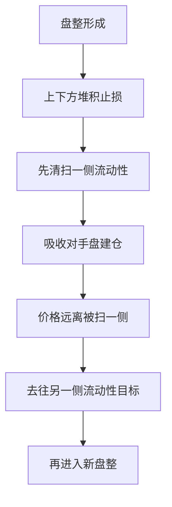

## 章节概要

- `00:00-02:59` 核心主题：盘整区上下方的突破常是做市商陷阱，反方向逻辑完全对称
- `03:00-05:35` 订单分布视角：旧高上方堆积买方止损，旧低下方堆积卖方止损，做市商会优先清扫其中一侧
- `05:36-08:59` 看涨模型：先扫盘整下方卖方止损，再把价格上推到旧高上方的买方止损
- `09:00-13:12` 重复出现的节奏：跌破盘整、拒绝低位、吸收流动性、向上扩张、再进入新盘整
- `13:13-17:59` 市场效率范式：不要把做市商妖魔化，要理解价格行为首先是在寻求流动性
- `18:00-23:02` 进阶读图：利用等距波动和更高时间框架参考位，估算价格后续目标区

## 笔记

这节课确实很重要，因为它把 Month 2 前面很多内容都收束起来了：盘整、止损分布、流动性、IPDA、市场效率范式、以及“如何像做市商一样思考”。ICT 在这里真正想讲的，不是“突破都是假的”，而是要你先看清盘整两侧到底堆积了什么订单，再判断价格更可能先去哪里取流动性。

### 1. 假突破的本质，不是“假”，而是清扫流动性的第一步

- 课程开头直接区分了两种场景：看跌背景下，常见的是盘整上方的假突破；看涨背景下，常见的是盘整下方的假突破
- ICT 为了节省时间，只重点讲看涨场景，也就是“跌破盘整下方后反而上涨”的模型
- 这类走势之所以会骗到突破交易者，是因为盘整天生就会让人把挂单放在区间上下两端
- 因此所谓“假突破”，其实往往只是机构在先清扫某一侧堆积的止损流动性，然后才展开真正的价格交付

### 2. 盘整两侧到底堆积了什么订单

- 在旧高点上方，通常有两类买方：突破买入者的止损触发单，以及空头交易者的买方止损
- 在旧低点下方，也通常有两类卖方：多头交易者的卖方止损，以及突破做空者的卖出止损
- 这意味着盘整本身并不重要，真正重要的是它把流动性清晰地堆放在了上下两侧
- 从做市商视角看，这不是“图形”，而是一张非常清楚的流动性地图

![[M2-08_盘整两侧止损分布.jpg]]

### 3. 看涨虚假突破模型：先扫下方止损，再上推到上方止损

- 课程中重点讲的是看涨背景：市场跌破盘整下方，把下方卖方止损全部激活
- 这些卖方止损对聪明钱来说，不是危险，而是多头建仓所需要的对手盘
- 一旦这部分流动性被吸收，价格就开始向上扩张
- 接下来它要去哪里？答案不是随便哪里，而是旧高点上方的买方止损区域
- 因为聪明钱后续减仓、对冲或部分止盈，都需要在那里找到愿意继续买入的人

![[M2-08_扫低后上拉逻辑.jpg]]

### 4. 市场看涨，不是因为趋势线朝上，而是因为它不断扫低后拒绝低位

- ICT 在这节课里不断重复一个问题：为什么这里仍然是看涨的？
- 他的答案并不是“因为均线金叉”或“因为更高高点更高低点”，而是因为价格反复被压到盘整下方、吸收卖方止损后，又迅速向上扩张
- 换句话说，真正的看涨特征不是图形朝上，而是市场每次扫低之后都选择远离低位
- 这就是一个非常重要的 order-flow 读法：看价格先去哪边、扫完哪边、然后又最坚决地离开哪边

### 4.5 我更愿意把这类反向释放结构称为“弹簧”

- 如果从更抽象的结构角度看，上一节课里的假突破在这里其实可以进一步命名为一种 `弹簧` 事件
- 这个名字的直觉很贴切：价格先在局部区间内被压缩，随后向一侧做假突破或清扫流动性，再迅速反向释放
- 因此，`弹簧` 比单纯说“假突破”更强调完整过程：`压缩 -> 清扫 -> 回收 -> 释放`
- 这样定义后，它就不只是一个主观比喻，而是一个可以继续研究和规则化的结构术语
- 如果后面延伸到量化，`弹簧` 可以被视为一类事件模板，用来描述那些先扫一侧止损、再向另一侧快速交付的行情

### 5. 流动性目标更应看实体上方，而不只是影线极值

- 字幕里有一个细节很重要：ICT 明确提醒，若讨论交易量和流动性，更应优先关注蜡烛实体而非单纯影线
- 因为在他的框架里，主要成交量更多体现在实体区域，所以上方真正值得关注的流动性，往往会留在实体上方
- 这也是为什么课程里会追踪 `109.40`、`109.45-109.50` 一类的具体水平
- 这些水平不是随手拍脑袋，而是实体、旧高和止损密集区共同重合后的结果
- `08:33` 左右还有一个很实用的补充：平整高点与平整低点本身就是明显的流动性池，因为这些位置上方或下方通常天然堆积着一批止损单

![[M2-08_实体上方流动性目标.jpg]]

### 6. 市场效率范式：不要觉得做市商在“害你”

- 这节课最成熟的一点，是 ICT 明确反对把做市商妖魔化
- 他说做市商并不是“专门来搞你”，他们只是在履行自己的职责：提供流动性、匹配订单、完成定价
- 当交易者缺乏结构理解时，往往会觉得自己的止损总被“针对”，甚至怪经纪商
- 但如果你理解市场总是在寻找最近、最容易触及、尚未被扫过的流动性区域，这些动作就不再神秘
- 于是你会从“受害者视角”转向“流动性提供者视角”

### 7. 真正该问的问题是：市场现在想找买方，还是想找卖方？

- ICT 在后半段把问题进一步简化：前高点上方总有买方，前低点下方总有卖方
- 所以你不需要每天先问“信号出现没有”，而应该先问“市场现在更想去找哪一边的流动性？”
- 一旦确定这个方向，后面的盘整跌破、盘整突破、回抽、扩张，都只是执行阶段的展开
- 这也解释了为什么他总说：当市场进入盘整后，只要你知道前提方向，交易设置会开始变得非常清晰

### 8. 等距波动不是孤立技巧，而是目标定价的补充工具

- 课程最后补充了一个很多人容易忽略的点：等距波动可以帮助估算算法后续的目标位
- 例子里，价格从一个买点向上拉出第一段波幅后，第二段上冲往往会与第一段接近等长
- 例如从 `108.75` 到 `109.25`，以及后续从 `108.85` 推算到 `109.80`，都是在做这种等距推演
- 最终 `109.90` 还与日线级别看跌订单块形成了更高层级的共振，这就让目标区更可信

![[M2-08_等距波动目标.jpg]]

### 9. 这节课其实是 Month 2 的压轴：把“位置、流动性、订单流、目标”串成一条链

- 前面几节课分别讲了风险、低风险 setup、复利、不要怕亏、流程化选择、假旗形
- 到这一节，ICT 基本把这些东西统一进了一个最实用的框架：
- 先识别市场前提和盘整，再识别两侧止损分布，然后观察哪一侧被先清扫，最后顺着价格去另一侧流动性目标
- 这套链路之所以重要，是因为它比单纯追信号稳定得多，也更接近程序化、结构化的交易建模思维

## 关键概念

- 虚假突破
- 做市商陷阱
- 盘整 / 交易区间
- 买方止损
- 卖方止损
- 流动性
- [[IPDA 银行间价格交付算法]]
- 市场效率范式
- 等距波动
- 弹簧
- [[OrderBlock 订单块]]

## 要点总结

- 盘整本身不是重点，重点是盘整上下方各自堆积了哪些止损流动性
- 看涨背景下，跌破盘整下方往往不是看空确认，而是为多头建仓服务的虚假突破
- 真正的方向判断来自“扫哪边、随后远离哪边”，而不是机械追突破
- 若理解市场总是在寻找流动性，就不会再把假突破简单看成随机噪音
- 这节课把流动性、订单流、目标位和做市商视角连成了一套非常实用的交易框架
- 平整高点与平整低点值得特别重视，因为它们常常对应最显眼、也最容易被清扫的止损堆积区
- 如果把这类假突破进一步抽象，我更愿意称它为 `弹簧`：先压缩、再清扫、随后快速反向释放

## 量化部分

- 这节课对量化非常重要，因为它讲的不是主观安慰，而是可以拆成规则的市场结构：`盘整识别 -> 两侧止损分布 -> 先扫哪边 -> 扫后是否快速远离 -> 下一侧流动性目标`
- 与旗形那一课不同，假突破这里的结构相对更容易编码，因为“盘整、上下边界、突破、回到区间内、后续扩张方向”都比经典视觉形态更可定义
- 真正值得量化研究的变量包括：盘整持续时间、区间宽度、突破幅度、回收速度、实体高低点、上方/下方最近流动性池距离、以及突破后到目标位的分布
- `IPDA`、机构订单流、市场效率范式在这里不是抽象理念，而是策略逻辑本身：价格为何先扫低、为何再拉高、为何目标常在对侧止损池
- 如果做量化，这节课非常适合转成事件驱动模型：在高时间框架前提成立时，检测盘整下破后的快速回收与上行延续，而不是机械交易所有 breakout
- 这也是为什么这节课特别重要：它已经非常接近真正可系统化的结构 edge，而不只是给人类交易员的心理训练
- 进一步说，量化里可以围绕多个 `fractal(x)` 去定义流动性层级：`x` 可以根据前面 fractal 的生长理论设置阈值；当某个高点和低点形成后，如果价格在这个范围内停留较久、往返较多，会为这组 `fractal(x)` 附近累积更多流动性提供额外加分，但这并不是必备条件
- 这样一来，流动性不再只是“某个高点/低点是否存在”，而是可以被建模成带权重的结构变量：停留时间、触碰次数、区间压缩程度、以及后续突破前的能量积累，都可以作为衡量该处流动性厚度的代理指标
- 一旦把时间引入 `fractal(x)` 的层级结构，流动性位置就从静态价格标记升级为时空共同定义的权重区域，因此判断会更可靠
- 进一步落到实现上，平整高点或平整低点可以近似建模为多个仍然存活、且价格距离较近的 `fractal(3)` 聚类；这种聚类越密集、持续越久，往往代表该区域累积了更多止损流动性
- 对这类虚假突破，如果采用右侧交易思路，还可以记录一个初步的量化约束：不能只看“扫了一下就回来”，还应加入 `CISD` 确认，否则清扫深度不够时很容易误判；更完整的研究假设可以写成：`CISD + 清扫距离倍数 + 在限定时间内完成等距反向运行`
- 其中“等距反向运行”可以先用一个实验性参数来定义，例如要求价格在限定时间内，回到突破距离反向的 `1.375` 倍位置，可先借用斐波那契比例做实验；这暂时只是研究假设，但适合作为事件确认过滤条件去回测
- 相比直接用 `ATR` 在高点或低点外侧粗略描绘突破范围，这种做法本质上是用更多滞后性，去换取更高质量的确认突破；如果后续验证有效，还可以进一步和期权结构结合，例如垂直价差，甚至在风险约束明确时研究与裸买思路的适配性
- 如果采用你现在的术语体系，那么这里的核心事件也可以统一写成 `弹簧因子`：先识别压缩，再识别一侧流动性清扫，最后检测是否在限定时间内完成回收与反向释放
