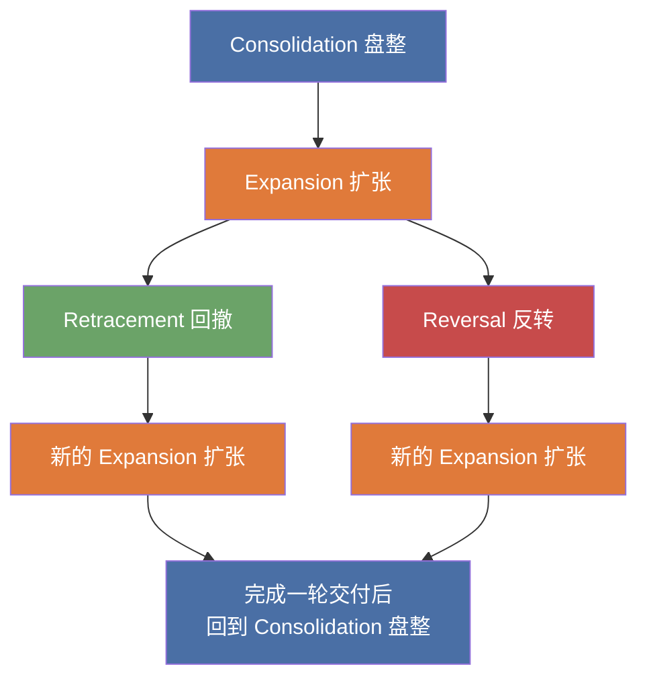

---
aliases:
  - Bank Price Delivery Algorithm
  - 银行价格交付算法
tags:
  - 概念
---

## 定义

ICT 在 M1-01 中称其为"银行价格交付算法"（Bank Price Delivery Algorithm）。按课程表述，它本质上是驱动价格的人工智能引擎；货币报价大部分由电子算法完成，价格通过特定规则被交付。

## 识别条件

- 市场价格只会通过四种状态之一被交付：[[Consolidation 盘整]]、[[Expansion 扩张]]、[[Retracement 回撤]]、[[Reversal 反转]]
- 理解该算法，不是去预测每一根K线，而是判断市场当前处于哪一种状态，以及下一步更可能转向哪里
- 在 `M1-02` 中，这套交付被进一步强调为固定顺序：市场先从 [[Consolidation 盘整]] 开始，再进入 [[Expansion 扩张]]，之后才可能发展出 [[Retracement 回撤]] 或 [[Reversal 反转]]
- 同一套交付逻辑可以映射到日内时间结构，例如 `Judas Swing 犹大摇摆`、伦敦时段反转与后续扩张

## 相关概念
- [[Consolidation 盘整]]
- [[Expansion 扩张]]
- [[Retracement 回撤]]
- [[Reversal 反转]]
- [[Judas Swing 犹大摇摆]]

## 出现课程
- [[M1-01 交易设置的要素]]
- [[M1-02 市场做市商如何引导市场]]
- [[M1-03 现阶段应该关注什么]]
